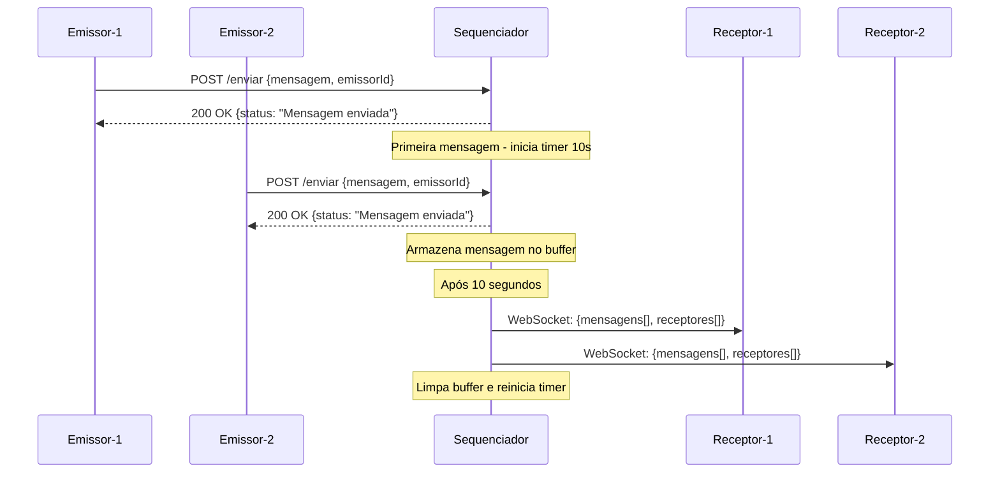

# Sequenciador Fixo - Sistema de Comunicação Cliente-Servidor

## Descrição do Projeto

Este projeto implementa um sistema de comunicação distribuída baseado no paradigma cliente-servidor, onde múltiplos **emissores** enviam mensagens para um **sequenciador central** que atua como middleware, redistribuindo as mensagens para todos os **receptores** conectados após um período de 10 segundos. O sistema utiliza WebSockets para comunicação em tempo real e HTTP para envio de mensagens.

## Requisitos Funcionais

### Servidor (Sequenciador)

- **Porta**: 3000
- **Tecnologias**: Node.js, Express.js, Socket.IO, CORS
- **Funcionalidades**:
  - Receber mensagens HTTP POST dos emissores
  - Armazenar mensagens temporariamente por 10 segundos
  - Redistribuir mensagens via WebSocket para todos os receptores
  - Gerenciar identificação de processos (emissores e receptores)

### Clientes

#### Emissores

- **Interface**: Página HTML (`emissor.html`)
- **Protocolo de Comunicação**: HTTP POST
- **Endpoint**: `http://localhost:3000/enviar`
- **Dados Enviados**:
  ```json
  {
    "mensagem": "Conteúdo da mensagem",
    "emissorId": "ID único do emissor"
  }
  ```

#### Receptores

- **Interface**: Página HTML (`receptor.html`)
- **Protocolo de Comunicação**: WebSocket
- **Dados Recebidos**:
  ```json
  {
    "mensagens": [
      {
        "mensagem": "Conteúdo da mensagem",
        "emissor": "ID do emissor",
        "timestamp": 1641024000000
      }
    ],
    "receptores": [
      { "id": 1, "nome": "Receptor-1" },
      { "id": 2, "nome": "Receptor-2" }
    ]
  }
  ```

## Comunicação Cliente-Servidor

### Diagrama de Sequência



### Fluxo de Comunicação

1. **Envio de Mensagens**: Emissores enviam mensagens via HTTP POST para o endpoint `/enviar`
2. **Armazenamento Temporário**: O sequenciador armazena as mensagens em um array na memória
3. **Timer de 10 segundos**: Ao receber a primeira mensagem, inicia-se um timer de 10 segundos
4. **Redistribuição**: Após 10 segundos, todas as mensagens são enviadas simultaneamente para todos os receptores via WebSocket
5. **Reset**: O buffer é limpo e o sistema aguarda novas mensagens

## Descrição do Serviço

O serviço é implementado como uma aplicação Node.js que atua como middleware entre emissores e receptores:

### Inicialização do Servidor

```javascript
const express = require("express");
const http = require("http");
const socketIo = require("socket.io");
const cors = require("cors");

const app = express();
const server = http.createServer(app);
const io = socketIo(server, {
  cors: {
    origin: "http://10.1.1.108:8080",
    methods: ["GET", "POST"],
    allowedHeaders: ["Content-Type"],
    credentials: true,
  },
});
```

### Armazenamento de Estado

```javascript
let mensagens = [];
let emissores = [];
let receptores = [];
let tempoInicial = null;
let timeoutID = null;
```

## Blocos de Código Principais

### 1. Recepção de Mensagens no Servidor

```javascript
app.post("/enviar", (req, res) => {
  const { mensagem, emissorId } = req.body;

  // Armazenando a mensagem com a identificação do emissor
  mensagens.push({ mensagem, emissor: emissorId, timestamp: Date.now() });

  // Se for a primeira mensagem, armazena o tempo
  if (!tempoInicial) {
    tempoInicial = Date.now();
    console.log(
      "Primeira mensagem recebida, começando a contagem de 10 segundos!"
    );

    // Limpa as mensagens após 10 segundos
    clearTimeout(timeoutID);
    timeoutID = setTimeout(() => {
      console.log("10 segundos se passaram, enviando mensagens...");
      // Envia as mensagens para todos os receptores
      io.emit("mensagens", { mensagens, receptores });
      mensagens = [];
      tempoInicial = null;
    }, 10000);
  }

  res.status(200).send({ status: "Mensagem enviada com sucesso!" });
});
```

### 2. Envio de Mensagens pelo Emissor

```javascript
function enviarMensagem(emissorId) {
  const mensagem = document.getElementById(`mensagem-${emissorId}`).value;

  fetch("http://localhost:3000/enviar", {
    method: "POST",
    headers: { "Content-Type": "application/json" },
    body: JSON.stringify({ mensagem, emissorId }),
  })
    .then((response) => response.json())
    .then((data) => console.log(data.status))
    .catch((error) => console.error("Erro ao enviar mensagem:", error));
}
```

### 3. Recepção de Mensagens pelo Receptor

```javascript
const socket = io("http://localhost:3000");

// Evento de recebimento de mensagens
socket.on("mensagens", function (data) {
  // Para cada receptor, exibe as mensagens recebidas no bloco correspondente
  data.mensagens.forEach((mensagem) => {
    // Todos os receptores recebem as mesmas mensagens
    receptores.forEach((receptor) => {
      receptor.mensagens.push(mensagem);
      displayMensagens(receptor.id);
    });
  });
});
```

### 4. Definição dos Números dos Processos

```javascript
// Criação de emissores com IDs únicos
function criarEmissores() {
  const quantidade = document.getElementById("quantidadeEmissores").value;
  emissores = [];
  for (let i = 1; i <= quantidade; i++) {
    emissores.push({ id: i, nome: `Emissor-${i}` });
  }
  displayEmissores();
}

// Criação de receptores com IDs únicos
function criarReceptores() {
  const quantidade = document.getElementById("quantidadeReceptores").value;
  receptores = [];
  for (let i = 1; i <= quantidade; i++) {
    const receptor = { id: i, nome: `Receptor-${i}`, mensagens: [] };
    receptores.push(receptor);
    // Criação da interface visual para cada receptor
  }
}
```

## Como Executar o Projeto

### Pré-requisitos

- Node.js instalado
- NPM ou Yarn
- http-server (para servir os arquivos HTML)

### Instalação

```bash
cd SequenciadorFixo
npm install
```

#### Instalação do http-server (necessário para os arquivos HTML)

```bash
# Instalar globalmente
npm install -g http-server

# Ou instalar localmente no projeto
npm install http-server --save-dev
```

### Execução

1. **Iniciar o servidor sequenciador:**

```bash
node sequenciador.js
```

2. **Iniciar o servidor HTTP para os arquivos HTML:**

```bash
# Se instalado globalmente
http-server

# Se instalado localmente
npx http-server

# Ou especificar porta (exemplo: porta 8080)
http-server -p 8080
```

### Acesso às Interfaces

- **Servidor Sequenciador**: Executando na porta 3000
- **Emissores**: Abrir `http://localhost:8080/emissor.html` no navegador
- **Receptores**: Abrir `http://localhost:8080/receptor.html` no navegador

> **Nota**: Os arquivos `emissor.html` e `receptor.html` precisam ser servidos através de um servidor HTTP (como o http-server) para funcionar corretamente devido às políticas de CORS dos navegadores.

### Configuração de Rede

O sistema está configurado para aceitar conexões do IP `10.1.1.108:8080`. Para usar em localhost, altere as configurações de CORS no arquivo `sequenciador.js`.

## Arquitetura do Sistema

- **sequenciador.js**: Servidor principal que gerencia a comunicação
- **emissor.html**: Interface web para os processos emissores
- **receptor.html**: Interface web para os processos receptores
- **package.json**: Dependências e configurações do projeto

## Dependências

```json
{
  "cors": "^2.8.5",
  "express": "^5.1.0",
  "socket.io": "^4.8.1"
}
```

O sistema implementa um padrão de comunicação assíncrona com buffering temporal, garantindo que todas as mensagens sejam entregues simultaneamente a todos os receptores após o período de coleta de 10 segundos.
